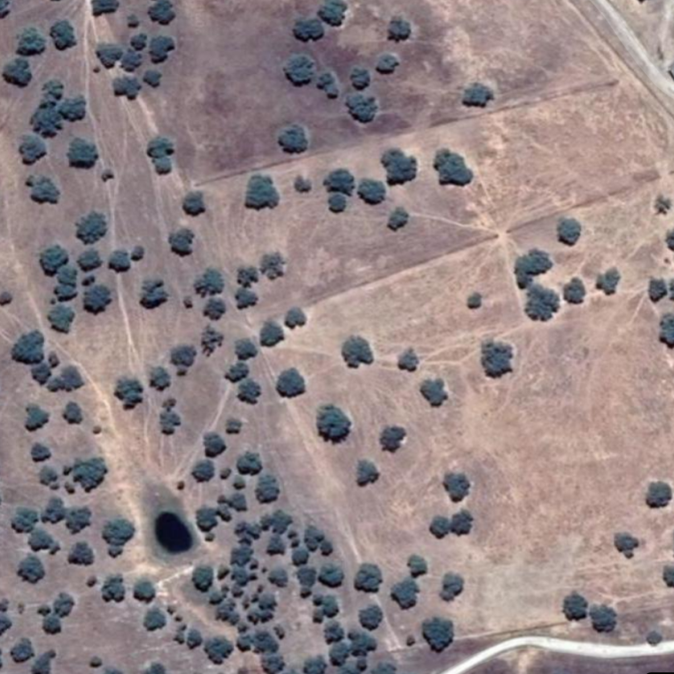

# Simulation of a population and a sampling WITHOUT covariates {#simWithout}


:::: {style="display: flex;"}

::: {.col data-latex="{0.45\textwidth}" style="font-style: italic; background-color: #d9d9d9; border-style:solid; width:45%"}

Con ayuda de R, vamos a simular una población de ciervos que se distribuye en un área de 100 km2 (100 cuadrados de 1 km de lado)

:::

::: {.col data-latex="{0.05\textwidth}"}
\ 
<!-- an empty Div (with a white space), serving as
a column separator -->
:::

::: {.col data-latex="{0.45\textwidth}" style="width:45%"}

With the help of R, we are going to simulate a deer population that is distributed in an area of 100 km2 (100 squares of 1 km on each side)

:::
::::

<br />

## the Poisson distribution

```{r libs, echo=FALSE, include=FALSE}

# install.packages("tinytex")
library(tinytex)
library(tidyverse)
library(dplyr)

library(raster)
library(reshape2)
library(unmarked)

# raster mapipulation R package: https://github.com/statnmap/cartomisc
library(cartomisc)
library(sp)  # avoids error in as.double(y) : cannot coerce type 'S4' to vector of type 'double'

```


```{r simCode, echo=TRUE, include=TRUE}
set.seed(1) # ajustamos una "semilla"" para controlar la repetibilidad 
# Con el paquete "raster" creamos una cuadrícula de 10x10
library(raster)
sarea <- raster(nrows = 10, ncols = 10, xmn = 0, xmx = 10, ymn = 0, ymx = 10)


```


<br />

:::: {style="display: flex;"}

::: {.col data-latex="{0.45\textwidth}" style="font-style: italic; background-color: #d9d9d9; border-style:solid; width:45%"}

Este área de momento está vacía, por lo que tendremos que “llenarla” de ciervos virtuales (proceso de abundancia, o state process). Podemos utilizar una distribución de Poisson para “esparcir” nuestros ciervos simulados en el área de estudio. Esta distrubución es una de las más comunmente utilizadas en el estudio de abundancias. La distribución de Poisson maneja la frecuencia con la que un evento ocurre en un intervalo específico. Consta de un único parámetro llamado lambda λ que determina el número de eventos que ocurren normalmente en ese intervalo. 

:::

::: {.col data-latex="{0.05\textwidth}"}
\ 
<!-- an empty Div (with a white space), serving as
a column separator -->
:::

::: {.col data-latex="{0.45\textwidth}" style="width:45%"}

This area is currently empty, so we will have to "fill" it with virtual deer (abundance process, or state process). We can use a Poisson distribution to “spread” our simulated deer in the study area. This distribution is one of the most commonly used in the study of abundances. The Poisson distribution handles the frequency with which an event occurs in a specific interval. It consists of a single parameter called lambda λ that determines the number of events that normally occur in that interval. 

:::
::::

<br />

```{r eval=FALSE, echo=TRUE, include=TRUE}

# generate a random poisson distribution, 10000 values
poissonVector <- rpois(n = 10000, lambda = 4)
# convert the vector into a df
df <- data.frame(poissonCount = poissonVector)

ggplot(data=df, aes(x = poissonCount)) +
  geom_histogram(bins = 14, color = "black", fill="white") +
  theme_bw() +
  labs(	x = "poisson value (count)", 
        y = "occurrences (frequency)", 
        title = "poisson distribution\nlambda = 4")

```
 
<br />

:::: {style="display: flex;"}

::: {.col data-latex="{0.45\textwidth}" style="width:45%"}


```{r gg1, echo=FALSE, include=TRUE}

# generate a random poisson distribution, 10000 values
poissonVector <- rpois(n = 10000, lambda = 4)

# convert the vector into a df
df <- data.frame(poissonCount = poissonVector)

library(ggplot2)

ggplot(data=df, aes(x = poissonCount)) +
  geom_histogram(bins = 14, color = "black", fill="white") +
  theme_bw() +
  labs(	x = "poisson value (count)", y = "occurrences (frequency)", title = "poisson distribution\nlambda = 4")

```
 

:::

::: {.col data-latex="{0.05\textwidth}"}
\ 
<!-- an empty Div (with a white space), serving as
a column separator -->
:::

::: {.col data-latex="{0.45\textwidth}" style="width:45%"}


```{r gg2, echo=FALSE, include=TRUE}

# generate a random poisson distribution, 10000 values
poissonVector <- rpois(n = 10000, lambda = 8)

# convert the vector into a df
df <- data.frame(poissonCount = poissonVector)

library(ggplot2)

ggplot(data=df, aes(x = poissonCount)) +
  geom_histogram(bins = 14, color = "black", fill="white") +
  theme_bw() +
  labs(	x = "poisson value (count)", y = "occurrences (frequency)", title = "poisson distribution\nlambda = 8")

```
  

:::
::::

<br />


## distribute a simulated deer population


:::: {style="display: flex;"}

::: {.col data-latex="{0.45\textwidth}" style="font-style: italic; background-color: #d9d9d9; border-style:solid; width:45%"}

En nuestro caso, el intervalo una unidad espacial, una cuadrícula, mientras que el evento será la presencia de un ciervo. El parámetro λ será la “abundancia esperada”, esto es, la abundancia media por cuadrícula. El número y la distribución de los ciervos virtuales que colocaremos en nuestro área de estudio vendrá determinado por una distribución de Poisson con λ=4: 

:::

::: {.col data-latex="{0.05\textwidth}"}
\ 
<!-- an empty Div (with a white space), serving as
a column separator -->
:::

::: {.col data-latex="{0.45\textwidth}" style="width:45%"}

In our case, the interval will be a spatial unit, a grid, while the event will be the presence of a deer. The parameter λ will be the “expected abundance”, that is, the mean abundance per grid. The number and distribution of virtual deer that we will place in our study area will be determined by a Poisson distribution with λ = 4: 

:::
::::

<br />

$$ N_{i} \sim Poisson(λ) $$
<br />

:::: {style="display: flex;"}

::: {.col data-latex="{0.45\textwidth}" style="font-style: italic; background-color: #d9d9d9; border-style:solid; width:45%"}

siendo $N_{i}$ el número total de individuos en la celda i.

Como podemos ver en el histograma de la izquierda, los valores más probables serán 3 o 4 ciervos, aunque variarán entre cero y 14 aproximadamente (aunque este útimo valor será muy poco probable). 

:::

::: {.col data-latex="{0.05\textwidth}"}
\ 
<!-- an empty Div (with a white space), serving as
a column separator -->
:::

::: {.col data-latex="{0.45\textwidth}" style="width:45%"}

where $N_{i}$ is the total number of individuals in cell i.

As we can see in the histogram on the left, the most probable values will be 3 or 4 deer, although they will vary between zero and 14 approximately (although this last value will be very unlikely). 

:::
::::

<br />


```{r echo=TRUE, include=TRUE}

# Javier's chart: below left

# Seleccionamos el lambda deseado
lambda <- 4

# Generamos 100 números aleatorios obtenidos de una distribucion
# de Poisson con una lambda = 4
sarea[] <- rpois(100, lambda)  


```


```{r eval=FALSE, echo=TRUE, include=TRUE}

# Javier's chart: below left

plot(sarea) 
```


```{r echo=TRUE, include=TRUE}

# ggplot() setup 

# extract S4 data and build vector
area.vector <- as.vector(sarea)
# convert to matrix
area.matrix <- matrix(area.vector, byrow=T, nrow=10, ncol=10)
# reverse the rows (so we can compare plots)
area.matrix <- apply(area.matrix,2,rev)
colnames(area.matrix) <- c(1,2,3,4,5,6,7,8,9,10)
rownames(area.matrix) <- c(1,2,3,4,5,6,7,8,9,10)

longData<-melt(area.matrix)
longData<-longData[longData$value!=0,]

# 
# have ggplot() use the same colors as does plot()
#
# fine tuning
# remove the first element to shift the
# yellow closer to the middle of the palette
color.vector <- rev(terrain.colors(12))
color.vector <- color.vector[2:length(color.vector)]


```


```{r eval=FALSE, echo=TRUE, include=TRUE}

# ggplot() below right

ggplot(longData, aes(x = Var2, y = Var1)) + 
  geom_raster(aes(fill=value)) + 
  scale_fill_gradientn(colors=color.vector) +
  theme_bw() 
```


:::: {style="display: flex;"}

::: {.col data-latex="{0.45\textwidth}" style="border-style:solid; width:45%"}


```{r area1, echo=FALSE, include=TRUE}

# Graficamos nuestro área de estudio
plot(sarea)


``` 

:::

::: {.col data-latex="{0.05\textwidth}"}
\ 
<!-- an empty Div (with a white space), serving as
a column separator -->
:::

::: {.col data-latex="{0.45\textwidth}" style="width:45%"}


```{r area2, warning=FALSE, echo=FALSE, include=TRUE}

# fine tuning the cell colors.....
# remove the first element to shift the
# yellow closer to the middle of the palette
color.vector <- rev(terrain.colors(12))
color.vector <- color.vector[2:length(color.vector)]

ggplot(longData, aes(x = Var2, y = Var1)) + 
  geom_raster(aes(fill=value)) + 
  theme_bw()  +
  scale_fill_gradientn(colors=color.vector) 
   

```
 

:::
::::

<br />


:::: {style="display: flex;"}

::: {.col data-latex="{0.45\textwidth}" style="font-style: italic; background-color: #d9d9d9; border-style:solid; width:45%"}

Si hacemos la suma de todas las celdas de nuestro área de estudio, podremos saber el número total de individuos que hemos simulado (N): 

:::

::: {.col data-latex="{0.05\textwidth}"}
\ 
<!-- an empty Div (with a white space), serving as
a column separator -->
:::

::: {.col data-latex="{0.45\textwidth}" style="width:45%"}

If we do the sum of all the cells in our study area, we will be able to know the total number of individuals that we have simulated (N): 

:::
::::

<br />


```{r s1, warning=FALSE, echo=TRUE, include=TRUE}

# Calculamos el número total de ciervos virtuales creados (N)
sum(sarea[])
   

```
 
<br />

:::: {style="display: flex;"}

::: {.col data-latex="{0.45\textwidth}" style="font-style: italic; background-color: #d9d9d9; border-style:solid; width:45%"}

Podemos también hacer la media de individuos en cada celda, que debería aproximarse a λ=4: 

:::

::: {.col data-latex="{0.05\textwidth}"}
\ 
<!-- an empty Div (with a white space), serving as
a column separator -->
:::

::: {.col data-latex="{0.45\textwidth}" style="width:45%"}

We can also take the average of individuals in each cell, which should approximate λ = 4: 

:::
::::

<br />


```{r s2, warning=FALSE, echo=TRUE, include=TRUE}

mean(sarea[])
   

```
 

<br />

## Sampling Simulation

:::: {style="display: flex;"}

::: {.col data-latex="{0.45\textwidth}" style="font-style: italic; background-color: #d9d9d9; border-style:solid; width:45%"}

A continuación tenemos que simular nuestro muestreo (proceso de detectabilidad o observational process). Éste consistirá en 15 cuadrículas aleatorias de nuestro área de estudio a las cuales realizaremos 4 visitas (ocasiones). Durante los muestreos intentaremos detectar el máximo número posible de ciervos, pero desgraciadamente sabemos que tenemos una eficacia o probabilidad de detección del 40% para todo nuestro área de estudio. Esto significa que, en general, seremos capaces de detectar menos de la mitad de ciervos en cada muestreo. Para simular esta detectabilidad podemos utilizar una distribución binomial. La distribución binomial maneja la probabilidad de éxito para un número de sucesos con dos resultados posibles: éxito o fracaso (cara o cruz, par o impar, etc.). Pongamos que una celda tiene 10 ciervos. La detección de cada uno de esos 10 ciervos puede verse como 10 sucesos en los que puedo tener éxito (detecto al ciervo) o fracasar (el ciervo está, pero no lo detecto). De esta forma, tendríamos que 

:::

::: {.col data-latex="{0.05\textwidth}"}
\ 
<!-- an empty Div (with a white space), serving as
a column separator -->
:::

::: {.col data-latex="{0.45\textwidth}" style="width:45%"}

Next we have to simulate our sampling (detectability process or observational process). This will consist of 15 random grids from our study area to which we will make 4 visits (occasions). During the samplings we will try to detect the maximum possible number of deer, but unfortunately we know that we have an efficiency or probability of detection of 40% for our entire study area. This means that, in general, we will be able to detect less than half the deer in each sample. To simulate this detectability we can use a binomial distribution. The binomial distribution handles the probability of success for a number of events with two possible outcomes: success or failure (heads or tails, even or odd, etc.). Let's say a cell has 10 deer. Detecting each of those 10 deer can be viewed as 10 events where I can either succeed (detect the deer) or fail (the deer is there, but I don't detect it). In this way, we have 

:::
::::

<br />

$$ y_{i,k} \sim binomial(N_{i},p) $$
<br />

:::: {style="display: flex;"}

::: {.col data-latex="{0.45\textwidth}" style="font-style: italic; background-color: #d9d9d9; border-style:solid; width:45%"}

dónde $y_{i,k}$ es el número de individuos detectados en la celda i en la visita/ocasión k, $N_{i}$ es el número de individuos en la celda i y p es la probabilidad de detectar cada ciervo, siendo en nuestro caso p=0.4. Recapitulando, muestrearemos 15 cuadrículas aleatorias durante 4 visitas diferentes. En cada visita tendremos una probabilidad del 40% de ver cada uno de los ciervos que se encuentren en la cuadrícula. El siguiente código simula este proceso: 

:::

::: {.col data-latex="{0.05\textwidth}"}
\ 
<!-- an empty Div (with a white space), serving as
a column separator -->
:::

::: {.col data-latex="{0.45\textwidth}" style="width:45%"}

where $y_{i,k}$ is the number of individuals detected in cell i on visit / occasion k, $N_{i}$ is the number of individuals in cell i and p is the probability of detecting each deer, in our case being p = 0.4. Recapping, we will sample 15 random grids during 4 different visits. In each visit we will have a 40% probability of seeing each of the deer that are in the grid. The following code simulates this process: 

:::
::::

<br />


```{r s3, warning=FALSE, echo=TRUE, include=TRUE}

# Seleccionamos 15 celdas aleatorias de nuestro area de estudio
# (We selected 15 random cells from our study area)
site_ID <- sample(1:100, 15)
dataset <- data.frame(site_ID)

# Vamos a almacenar en número real de individuos de cada celda para poder hacer 
# comparaciones posteriormente
# (We are going to store the real number of individuals in each cell to be able 
#  to make comparisons later)
dataset$trueN <- extract(sarea,site_ID)

# Iniciamos nuestras 4 visitas
dataset$O1 <- NA
dataset$O2 <- NA
dataset$O3 <- NA
dataset$O4 <- NA

# Con un doble bucle, visitarremos 4 veces cada uno de nuestras 15 cuadrículas
# (With a double loop, we will visit each of our 15 grids 4 times)
for (j in 1:4){
  for (i in 1:length(site_ID)){
    # Nótese que los individuos detectados vienen determinados por una 
    # binomial con probabilidad 0.4, véase help(rbinom)
    # (Note that the detected individuals are determined by a binomial 
    #  with probability 0.4, see help (rbinom))
    dataset[i,j+2] <- rbinom(1, extract(sarea,site_ID[i]), 0.4)
  }
}
   

```
 

(so the model is assuming that each cell has a static micro-population of deer, but the observer does not know that number. rbinom() gives us different counts for each cell for each of the four visits)
<br />

## Sampled Cells

<br />

:::: {style="display: flex;"}

::: {.col data-latex="{0.45\textwidth}" style="font-style: italic; background-color: #d9d9d9; border-style:solid; width:45%"}

Una vez realizado el muestreo, veamos el resultado del mismo. Primero graficamos nuestro área de estudio con las celdas muestreadas: 

:::

::: {.col data-latex="{0.05\textwidth}"}
\ 
<!-- an empty Div (with a white space), serving as
a column separator -->
:::

::: {.col data-latex="{0.45\textwidth}" style="width:45%"}

Once the sampling is done, let's see the result of it. First we graph our study area with the sampled cells: 

:::
::::

<br />

```{r eval=F, warning=FALSE, echo=TRUE, include=TRUE}

# Javier's chart: below left

plot(sarea)
points(xyFromCell(sarea,site_ID), pch = 4, cex = 1.5)
   

```


```{r eval=FALSE, warning=FALSE, echo=TRUE, include=TRUE}

# ggplot() rough equivalent: below right

df <- as.data.frame(xyFromCell(sarea,site_ID))

# fine tuning the cell colors.....
# remove the first element to shift the
# yellow closer to the middle of the palette
color.vector <- rev(terrain.colors(12))
color.vector <- color.vector[2:length(color.vector)]
  
ggplot(longData, aes(x = Var2, y = Var1)) + 
  geom_raster(aes(fill=value)) + 
  geom_point(data=df, aes(x,y), position=position_nudge(x = 0.5, y = 0.5), 
             shape = 4, colour = "black", size = 5, stroke = 2) +
  theme_bw()  +
  #scale_fill_gradientn(colors=rev(terrain.colors(12))) 
  scale_fill_gradientn(colors=color.vector)
   

```
 
<br />


:::: {style="display: flex;"}

::: {.col data-latex="{0.45\textwidth}" style="width:45%"}

```{r  warning=FALSE, echo=FALSE, include=TRUE}

plot(sarea)
points(xyFromCell(sarea,site_ID), pch = 4, cex = 1.5)
   

``` 

:::

::: {.col data-latex="{0.05\textwidth}"}
\ 
<!-- an empty Div (with a white space), serving as
a column separator -->
:::

::: {.col data-latex="{0.45\textwidth}" style="width:45%"}

```{r  warning=FALSE, echo=FALSE, include=TRUE}

df <- as.data.frame(xyFromCell(sarea,site_ID))

# fine tuning the cell colors.....
# remove the first element to shift the
# yellow closer to the middle of the palette
color.vector <- rev(terrain.colors(12))
color.vector <- color.vector[2:length(color.vector)]
  
ggplot(longData, aes(x = Var2, y = Var1)) + 
  geom_raster(aes(fill=value)) + 
  geom_point(data=df, aes(x,y), position=position_nudge(x = 0.5, y = 0.5), 
             shape = 4, colour = "black", size = 5, stroke = 2) +
  theme_bw()  +
  #scale_fill_gradientn(colors=rev(terrain.colors(12))) 
  scale_fill_gradientn(colors=color.vector)
   

``` 

:::
::::

<br />

```{r eval=FALSE, echo=TRUE, include=TRUE, layout="l-body-outset"}

# Ahora, vamos a explorar el resultado de nuestros muestreos en cada una de las visitas:

dataset


```


```{r warning=FALSE, echo=TRUE, include=TRUE, layout="l-body-outset"}

# make a readable table

library(knitr)
kable(dataset)

```


:::: {style="display: flex;"}

::: {.col data-latex="{0.45\textwidth}" style="font-style: italic; background-color: #d9d9d9; border-style:solid; width:45%"}

La primera columna (site_ID) es un identificador de la cuadrícula. La segunda (trueN) indica el número real de individuos que se encuentran en cada cuadrícula de nuestro muestreo. Las 4 columnas siguientes (O1,O2… O4) indican el número de ciervos detectados en cada una de nuestras visitas/ocasiones. Como habíamos predicho, al tener un 40% de detectabilidad, casi siempre detectamos menos de la mitad de ciervos de los que realmente hay. 

:::

::: {.col data-latex="{0.05\textwidth}"}
\ 
<!-- an empty Div (with a white space), serving as
a column separator -->
:::

::: {.col data-latex="{0.45\textwidth}" style="width:45%"}

The first column (site_ID) is an identifier for the grid. The second (trueN) indicates the real number of individuals found in each grid of our sampling. The next 4 columns (O1, O2… O4) indicate the number of deer detected in each of our visits / occasions. As we had predicted, with 40% detectability, we almost always detect less than half as many deer as there actually are. 

:::
::::


<br />


:::: {style="display: flex;"}

::: {.col data-latex="{0.45\textwidth}" style="font-style: italic; background-color: #d9d9d9; border-style:solid; width:45%"}

En el mundo real, el problema surge al no conocer esa detectabilidad. Al realizar los distintos muestreos no sabemos realmente cuál es el procentaje de individios que somos capaces de detectar. Una primera estima sería quedarnos con el valor máximo de cada una de nuestras visitas para cada uno de los 15 muestreos. Asumiendo que la población en cada celda es cerrada (sin migración, nacimientos o muerte de individuos) el numero máximo de individuos detectados en cada una de las 4 visitas podría ser un buen punto de partida para aproximar una abundancia total. Lo calculamos y lo comparamos con el número real del siguiente modo: 

:::

::: {.col data-latex="{0.05\textwidth}"}
\ 
<!-- an empty Div (with a white space), serving as
a column separator -->
:::

::: {.col data-latex="{0.45\textwidth}" style="width:45%"}

In the real world, the problem arises from not knowing that detectability. When carrying out the different samplings, we do not really know what percentage of individuals we are capable of detecting. A first estimate would be to keep the maximum value of each of our visits for each of the 15 samplings. Assuming that the population in each cell is closed (without migration, births or death of individuals) the maximum number of individuals detected in each of the 4 visits could be a good starting point to approximate a total abundance. We calculate it and compare it with the real number as follows: 

:::
::::

<br />


```{r warning=FALSE, eval=FALSE, echo=TRUE, include=TRUE}

# Calculamos los individuos máximos detectados por visita
dataset$maxN <- apply(dataset[,3:6],1, max)

# Graficamos la relación con los individuos reales
plot(dataset$trueN, dataset$maxN, xlim = c(0,7.5), ylim = c(0,7.5), 
     xlab = "número real de individuos", ylab = "número detectado de individuos")
abline(0,1)

```


```{r echo=TRUE, include=TRUE}

# preserve source dataset
datasetJavi <- dataset

```


```{r warning=FALSE, eval=FALSE, echo=TRUE, include=TRUE}

# ggplot() version

datsetTidy <- datasetJavi %>% 
  rowwise %>% 
  mutate(maxN = max(c(O1, O2, O3, O4)))

ggplot() + 
  geom_jitter(data=datsetTidy, aes(trueN, maxN), 
             shape = 1, colour = "black", size = 5, stroke = 2) +
  geom_abline() + 
  xlim(0,7) +
  ylim(0,7) +
  theme_bw()  +
  labs(	x = "poisson deer population",
         		 	y = "max deer observed")


```

:::: {style="display: flex;"}

::: {.col data-latex="{0.45\textwidth}" style="width:45%"}


```{r warning=FALSE, echo=FALSE, include=TRUE}

# Calculamos los individuos máximos detectados por visita
datasetJavi$maxN <- apply(datasetJavi[,3:6],1, max)

# Graficamos la relación con los individuos reales
plot(datasetJavi$trueN, datasetJavi$maxN, xlim = c(0,7.5), ylim = c(0,7.5), 
     xlab = "número real de individuos", ylab = "número detectado de individuos")
abline(0,1)

``` 

:::

::: {.col data-latex="{0.05\textwidth}"}
\ 
<!-- an empty Div (with a white space), serving as
a column separator -->
:::

::: {.col data-latex="{0.45\textwidth}" style="width:45%"}


```{r warning=FALSE, echo=FALSE, include=TRUE}

# ggplot() version

datsetTidy <- datasetJavi %>% 
  rowwise %>% 
  mutate(maxN = max(c(O1, O2, O3, O4)))

ggplot() + 
  geom_jitter(data=datsetTidy, aes(trueN, maxN), 
             shape = 1, colour = "black", size = 5, stroke = 2) +
  geom_abline() + 
  xlim(0,7) +
  ylim(0,7) +
  theme_bw()  +
  labs(	x = "poisson deer population",
         		 	y = "max deer observed")

``` 

:::
::::

note, for the ggplot() version on the right, the points are "jittered" to expose overlapping data. Default jittering can cause some points to be drawn above the abline() line (suggesting an impossible result, that is, a trial count maximum greater than the poisson cell population).
<br />


:::: {style="display: flex;"}

::: {.col data-latex="{0.45\textwidth}" style="font-style: italic; background-color: #d9d9d9; border-style:solid; width:45%"}

Como veníamos intuyendo, infraestimamos el número real de ciervos. De hecho, como sabemos que tenemos un 40% de eficacia de detección, podríamos adelantar que, de media, seguramente estaremos detectando aproximadamente un 40% de ciervos de los que hay en realidad. Vamos a comprobarlo: 

:::

::: {.col data-latex="{0.05\textwidth}"}
\ 
<!-- an empty Div (with a white space), serving as
a column separator -->
:::

::: {.col data-latex="{0.45\textwidth}" style="width:45%"}

As we had been intuiting, we underestimated the real number of deer. In fact, as we know that we have a 40% detection efficiency, we could anticipate that, on average, we will surely be detecting approximately 40% of the deer that there are in reality. Let's check it out: 

:::
::::

<br />


```{r echo=TRUE, include=TRUE}

# Calculamos la media de individuos vistos en las 4 visitas
dataset$meanN <- apply(dataset[,3:6],1, mean)

#Sumamos las medias de los 15 sitios y lo comparamos con los valores reales
sum(dataset$meanN) / sum(dataset$trueN)

```

<br />


:::: {style="display: flex;"}

::: {.col data-latex="{0.45\textwidth}" style="font-style: italic; background-color: #d9d9d9; border-style:solid; width:45%"}

Efectivamente, de media estamos viendo un 39% de los individuos que realmente hay. Para poder ajustar un modelo que fuese capaz de calcular el número total de individuos, deberíamos primero ser capaces de calcular esa detectabilidad, esto es, el parámetro p de la distribución binomial. 

:::

::: {.col data-latex="{0.05\textwidth}"}
\ 
<!-- an empty Div (with a white space), serving as
a column separator -->
:::

::: {.col data-latex="{0.45\textwidth}" style="width:45%"}

Indeed, on average we are seeing 39% of the individuals that there really are. In order to fit a model that is capable of calculating the total number of individuals, we should first be able to calculate that detectability, that is, the parameter p of the binomial distribution. 

:::
::::

<br />


# The simplest N-mixture model with unmarked {#unmarked}

:::: {style="display: flex;"}

::: {.col data-latex="{0.45\textwidth}" style="font-style: italic; background-color: #d9d9d9; border-style:solid; width:45%"}

Como ya hemos dicho, los N-mixture models nos permiten estimar a la vez la probabilidad de detección y la abundancia de nuestra especie a partir de muestreos repetidos. Para ajustar este tipo de modelos utilizaremos la función pcount del paquete unmarked. En primer lugar, debemos preparar los datos para que unmarked pueda leerlos. Utilizaremos la función unmarkedFramePCount para indicar cuales son los 15 muestreos repetidos en 4 ocasiones

:::

::: {.col data-latex="{0.05\textwidth}"}
\ 
<!-- an empty Div (with a white space), serving as
a column separator -->
:::

::: {.col data-latex="{0.45\textwidth}" style="width:45%"}

As we have already said, the N-mixture models allow us to estimate both the probability of detection and the abundance of our species from repeated samplings. To adjust these types of models we will use the pcount function of the unmarked package. First of all, we need to prepare the data so that unmarked can read it. We will use the unmarkedFramePCount function to indicate which are the 15 samples repeated 4 times

:::
::::

<br />
```{r echo=TRUE, include=TRUE}

dataUM.s4 <- unmarked::unmarkedFramePCount(y = dataset[,3:6])

```

<br />


```{r eval=FALSE, echo=TRUE, include=TRUE}

# Echamos un vistazo al objeto dataUM
head(dataUM.s4)

```

<br />

```{r echo=TRUE, include=TRUE}

# hack the s4 object to get the data
knitr::kable(head(dataUM.s4@y))


```

<br />


:::: {style="display: flex;"}

::: {.col data-latex="{0.45\textwidth}" style="font-style: italic; background-color: #d9d9d9; border-style:solid; width:45%"}

Ahora podremos ajustar nuestro modelo con la función pcount. Vamos a ajustar el modelo más sencillo posible. En este ejemplo, ni la abundancia ni la propabilidad de detección vienen determinados por ninguna covariable, simplemente responden a un proceso de Poisson con λ=4 y a una distribución binomial con p=0.4 respectivamente. Lo que intentaremos averiguar con este modelo será esos dos parámetros. 

:::

::: {.col data-latex="{0.05\textwidth}"}
\ 
<!-- an empty Div (with a white space), serving as
a column separator -->
:::

::: {.col data-latex="{0.45\textwidth}" style="width:45%"}

Now we can fit our model with the pcount function. We are going to adjust the simplest possible model. In this example, neither the abundance nor the probability of detection are determined by any covariate, they simply respond to a Poisson process with λ = 4 and a binomial distribution with p = 0.4 respectively. What we will try to find out with this model will be those two parameters. 

:::
::::

<br />

```{r echo=TRUE, include=TRUE}

# Como en este modelo no hay variables predictoras, las fórmulas de detectabilidad
# y de abundancia las dejamos como ~1 respectivamente.
#
# (As there are no predictor variables in this model, we leave the detectability 
#  and abundance formulas as ~ 1 respectively.)
#
# La sintaxis de pcount sería:
# pcount(fórmula_detectabilidad fórmula_abundancia, datos, número_suficientemente_alto)
# Para más información consultar help(pcount)
m1 <- unmarked::pcount(~1 ~1, data=dataUM.s4, K=50)
summary(m1)


```


<br />


:::: {style="display: flex;"}

::: {.col data-latex="{0.45\textwidth}" style="font-style: italic; background-color: #d9d9d9; border-style:solid; width:45%"}

La función nos devuelve las estimaciones de los parámetros λ y p transformados en log y logit respectivamente. Es decir, el modelo realmente ajusta el parámetro log(λ) y logit(p), por lo que a estas estimas hay que hacerles la transformación inversa: 

:::

::: {.col data-latex="{0.05\textwidth}"}
\ 
<!-- an empty Div (with a white space), serving as
a column separator -->
:::

::: {.col data-latex="{0.45\textwidth}" style="width:45%"}

The function returns the estimates of the parameters λ and p transformed into log and logit respectively. That is, the model really adjusts the parameters log (λ) and logit (p), so these estimates have to be carried out the inverse transformation: 

:::
::::

<br />

```{r echo=TRUE, include=TRUE}

# lambda estimada:
exp(coef(m1)[1]) # log


```

<br />

```{r echo=TRUE, include=TRUE}

# p estimada:
#exp(coef(m1)[2])/(1+exp(coef(m1)[2])) # log ratio o log odds = logit
plogis(coef(m1)[2]) # log ratio o log odds = logit; igual que arriba


```

<br />

:::: {style="display: flex;"}

::: {.col data-latex="{0.45\textwidth}" style="font-style: italic; background-color: #d9d9d9; border-style:solid; width:45%"}

Como vemos, la estima de λ es de 4.64 frente a la real, que era de 4. Por otro lado, la estima de p es de 0.35, mientras que la p real o detectabilidad era de 0.4. No es un modelo perfecto, pero se ajusta bastante a la realidad. ¿Cómo podríamos mejorar estas estimas? Incrementando el número de sitios muestreados, aumentando el número de visitas en cada sitio, etc. En cualquier caso, podemos calcular las abundancias predichas por nuestro modelo para cada sitio visitado y ver cómo se ajusta con respecto a la abundancia real. Para ello, usaremos la función bup: 

:::

::: {.col data-latex="{0.05\textwidth}"}
\ 
<!-- an empty Div (with a white space), serving as
a column separator -->
:::

::: {.col data-latex="{0.45\textwidth}" style="width:45%"}

As we can see, the estimate of λ is 4.64 compared to the real one, which was 4. On the other hand, the estimate of p is 0.35, while the real p or detectability was 0.4. It is not a perfect model, but it is quite realistic. How could we improve these estimates? Increasing the number of sampled sites, increasing the number of visits to each site, etc. In either case, we can calculate the abundances predicted by our model for each site visited and see how it adjusts with respect to the actual abundance. To do this, we will use the bup function: 

:::
::::

<br />

```{r echo=TRUE, include=TRUE}

# bup() stores the estimated posterior distributions of the latent abundance 
# or occurrence variables.

# Calculamos las predicciones de abundancias
N_m1.vector <- unmarked::bup(unmarked::ranef(m1)) 


```

<br />

```{r eval=FALSE, echo=TRUE, include=TRUE}

# graficamos la relación entre las abundancias reales y las predichas
plot(dataset$trueN, N_m1.vector, xlab="Abundancia simulada", ylab="Abundancia predicha")
abline(0,1) # a 1:1 line


```


```{r eval=FALSE, echo=TRUE, include=TRUE}

ggplot() + 
  geom_jitter(aes(dataset$trueN, N_m1.vector), 
             shape = 1, colour = "black", size = 5, stroke = 2) +
  geom_abline() + 
  xlim(2,8) +
  ylim(2,8) +
  theme_bw()  +
  labs(	x = "simulated abundance",
         		 	y = "predicted abundance")


```

<br />

:::: {style="display: flex;"}

::: {.col data-latex="{0.45\textwidth}" style="width:45%"}

```{r echo=FALSE, include=TRUE}

# graficamos la relación entre las abundancias reales y las predichas
plot(dataset$trueN, N_m1.vector, xlab="Abundancia simulada", ylab="Abundancia predicha")
abline(0,1) # a 1:1 line

```

:::

::: {.col data-latex="{0.05\textwidth}"}
\ 
<!-- an empty Div (with a white space), serving as
a column separator -->
:::

::: {.col data-latex="{0.45\textwidth}" style="width:45%"}

```{r echo=FALSE, include=TRUE}

ggplot() + 
  geom_jitter(aes(dataset$trueN, N_m1.vector), 
             shape = 1, colour = "black", size = 5, stroke = 2) +
  geom_abline() + 
  xlim(2,8) +
  ylim(2,8) +
  theme_bw()  +
  labs(	x = "simulated abundance",
         		 	y = "predicted abundance")

```
 

:::
::::


<br />

:::: {style="display: flex;"}

::: {.col data-latex="{0.45\textwidth}" style="font-style: italic; background-color: #d9d9d9; border-style:solid; width:45%"}

Vemos ahora que hemos solventado el problema de la infraestima. Este sencillo ejemplo nos sirve para explicar de forma clara el funcionamiento del modelo N-mixture. Sin embargo, la abundancia normalmente suele venir determinada por alguna covariable predictora que afecta a la distribución de las especies, como disponibilidad de recursos, refugio, etc. Por eso, a continuación simularemos otro set de datos y ajustatemos un modelo un poco más complejo.

:::

::: {.col data-latex="{0.05\textwidth}"}
\ 
<!-- an empty Div (with a white space), serving as
a column separator -->
:::

::: {.col data-latex="{0.45\textwidth}" style="width:45%"}

We now see that we have solved the problem of underestimation. This simple example helps us to clearly explain how the N-mixture model works. However, the abundance is usually determined by some predictive covariate that affects the distribution of the species, such as availability of resources, refuge, etc. Therefore, next we will simulate another set of data and fit a slightly more complex model. 

:::
::::

# Simulation of the study area and sampling WITH covariates

<br />

:::: {style="display: flex;"}

::: {.col data-latex="{0.45\textwidth}" style="font-style: italic; background-color: #d9d9d9; border-style:solid; width:45%"}

Supongamos ahora que nuestra población de ciervos virtuales se distribuye en un paisaje como el de la siguiente imagen

:::

::: {.col data-latex="{0.05\textwidth}"}
\ 
<!-- an empty Div (with a white space), serving as
a column separator -->
:::

::: {.col data-latex="{0.45\textwidth}" style="width:45%"}

Now suppose that our population of virtual deer is distributed in a landscape like the one in the following image 

:::
::::


<br />


Javier Fernández-López

<br />

:::: {style="display: flex;"}

::: {.col data-latex="{0.45\textwidth}" style="font-style: italic; background-color: #d9d9d9; border-style:solid; width:45%"}

Como vemos, hay un punto de agua en la parte inferior izquierda. Vamos a crear una capa raster que indique la distancia al punto de agua, la cual usaremos posteriormente como covariable predictora para distribuir nuestros ciervos.

:::

::: {.col data-latex="{0.05\textwidth}"}
\ 
<!-- an empty Div (with a white space), serving as
a column separator -->
:::

::: {.col data-latex="{0.45\textwidth}" style="width:45%"}

As we can see, there is a water point in the lower left. We are going to create a raster layer that indicates the distance to the water point, which we will later use as a predictor covariate to distribute our deer. 

:::
::::

<br />

```{r echo=TRUE, include=TRUE}

# Nótese que estamos estandarizando las distancias con scale(). 
# Para no obtener distancias negativas, le sumaremos 2.28668

# (Note that we are standardizing the distances with scale ().
# In order not to obtain negative distances, we will add 2.28668)

dwat.rasterLayer <- 
  raster::scale(raster::distanceFromPoints(sarea, c(3.5,3.5))) + 2.28668

# convert the raster to a dataframe for use by ggplot()
gg.raster.df <- cartomisc::gplot_data(dwat.rasterLayer)

```

<br />

```{r eval=F, echo=T, include=TRUE}

plot(dwat.rasterLayer)

```


```{r eval=F, echo=T, include=TRUE}
  
ggplot() +
  geom_tile(data = dplyr::filter(gg.raster.df, !is.na(value)), 
            aes(x = x, y = y, fill=value)) +
  scale_fill_gradientn(colors=color.vector) +
  theme_bw()  +
  labs(	x = "x", y = "y")
  
```

<br />


:::: {style="display: flex;"}

::: {.col data-latex="{0.45\textwidth}" style="width:45%"}


```{r eval=T, echo=F, include=TRUE}

plot(dwat.rasterLayer)


```


:::

::: {.col data-latex="{0.05\textwidth}"}
\ 
<!-- an empty Div (with a white space), serving as
a column separator -->
:::

::: {.col data-latex="{0.45\textwidth}" style="width:45%"}


```{r eval=TRUE, echo=F, include=TRUE}
  
ggplot() +
  geom_tile(data = dplyr::filter(gg.raster.df, !is.na(value)), 
            aes(x = x, y = y, fill=value)) +
  scale_fill_gradientn(colors=color.vector) +
  theme_bw()  +
  labs(	x = "x", y = "y")
  
```
 

:::
::::

<br />

:::: {style="display: flex;"}

::: {.col data-latex="{0.45\textwidth}" style="font-style: italic; background-color: #d9d9d9; border-style:solid; width:45%"}

En el ejemplo anterior, habíamos distribuido los ciervos aleatoriamente siguiendo una distribución de Poisson con λ=4 para todo el territorio (Eq 2).
:::

::: {.col data-latex="{0.05\textwidth}"}
\ 
<!-- an empty Div (with a white space), serving as
a column separator -->
:::

::: {.col data-latex="{0.45\textwidth}" style="width:45%"}

In the previous example, we had randomly distributed the deer following a Poisson distribution with λ = 4 for the entire territory (Eq 2).
:::
::::

<br />

$$ N_{i} \sim Poisson(λ) $$
<br />

:::: {style="display: flex;"}

::: {.col data-latex="{0.45\textwidth}" style="font-style: italic; background-color: #d9d9d9; border-style:solid; width:45%"}

Sin embargo, ahora queremos que nuestros ciervos se distribuyan conforme a la distancia al punto de agua, de tal forma que haya más ciervos cerca del agua, y su abundancia disminuya conforme nos vamos alejando de ella (estamos en una zona árida y durante la época estival el agua escasea, actuando como un atractor de ciervos). Eso quiere decir que λ (abundancia promedio) debe ser alta en aquellas celdas con valores bajos de distancia al agua dwat, e irá disminuyendo con forme aumente dwat. Este comportamiento se puede expresar como

:::

::: {.col data-latex="{0.05\textwidth}"}
\ 
<!-- an empty Div (with a white space), serving as
a column separator -->
:::

::: {.col data-latex="{0.45\textwidth}" style="width:45%"}

However, now we want our deer to be distributed according to the distance to the water point, in such a way that there are more deer near the water, and their abundance decreases as we move away from it (we are in an arid area and during the summer water is scarce, acting as a deer attractor). This means that λ (average abundance) must be high in those cells with low values of distance to water dwat, and it will decrease as dwat increases. This behavior can be expressed as

:::
::::

<br />

$$ log(λ) = \beta_{0} + \beta_{1} *  dwat_{i}  $$

<br />

:::: {style="display: flex;"}

::: {.col data-latex="{0.45\textwidth}" style="font-style: italic; background-color: #d9d9d9; border-style:solid; width:45%"}

donde λi es la abundancia promedio en la celda i, β0 es el intercepto del modelo lineal que predice la abundancia, β1 es la “fuerza” del efecto de la distancia al agua sobre la abundancia de ciervos (la fuerza con la que el agua atrae o repele a los ciervos), y dwati es la distancia al punto de agua desde la celda i. Así, podemos intuir que la λ de cada celda dependerá de la variable “distancia al agua”. Por lo tanto, la ecuación general que gobernará la distribución de nuestros ciervos ahora sera:

:::

::: {.col data-latex="{0.05\textwidth}"}
\ 
<!-- an empty Div (with a white space), serving as
a column separator -->
:::

::: {.col data-latex="{0.45\textwidth}" style="width:45%"}

where λi is the average abundance in cell i, β0 is the intercept of the linear model predicting abundance, β1 is the “force” of the effect of distance to water on deer abundance (the force with which the water attracts or repels deer), and dwati is the distance to the water point from cell i. Thus, we can guess that the λ of each cell will depend on the variable “distance to water”. Therefore, the general equation that will govern the distribution of our deer will now be:

:::
::::

<br />

$$ N \sim Poisson(exp(\beta_{0} + \beta_{1} *  dwat_{i}))  $$

<br />

:::: {style="display: flex;"}

::: {.col data-latex="{0.45\textwidth}" style="font-style: italic; background-color: #d9d9d9; border-style:solid; width:45%"}

Para que se cumpla nuestra premisa de que haya menos ciervos cuanto más nos alejemos del punto de agua, al coeficiente β1 deberemos darle un valor negativo (el agua atrae a los ciervos). Estos serán nuestros valores:

:::

::: {.col data-latex="{0.05\textwidth}"}
\ 
<!-- an empty Div (with a white space), serving as
a column separator -->
:::

::: {.col data-latex="{0.45\textwidth}" style="width:45%"}

In order to fulfill our premise that there are fewer deer the further we move from the water point, we must give the coefficient β1 a negative value (water attracts deer). These will be our values:

:::
::::

<br />

$\bullet \beta_{0} = 3 $
$\bullet \beta_{1} = -0.9 $
 
<br />

<br />

:::: {style="display: flex;"}

::: {.col data-latex="{0.45\textwidth}" style="font-style: italic; background-color: #d9d9d9; border-style:solid; width:45%"}

Calculamos la λ para cada celda siguiendo nuestra fórmula y los valores elegidos para los coeficientes:

:::

::: {.col data-latex="{0.05\textwidth}"}
\ 
<!-- an empty Div (with a white space), serving as
a column separator -->
:::

::: {.col data-latex="{0.45\textwidth}" style="width:45%"}

We calculate the λ for each cell following our formula and the values chosen for the coefficients:

:::
::::

<br />


```{r echo=TRUE, include=TRUE}

beta_0 <- 3
beta_1 <- -0.9

lambda.rasterLayer <- exp(beta_0 + beta_1*(dwat.rasterLayer))

# convert the raster to a dataframe for use by ggplot()
gg.raster.df <- cartomisc::gplot_data(lambda.rasterLayer)

```

<br />

```{r eval=F, echo=T, include=TRUE}

plot(lambda.rasterLayer)

```

<br />


```{r eval=F, echo=T, include=TRUE}
  
ggplot() +
  geom_tile(data = dplyr::filter(gg.raster.df, !is.na(value)), 
            aes(x = x, y = y, fill=value)) +
  scale_fill_gradientn(colors=color.vector) +
  theme_bw()  +
  labs(	x = "x", y = "y")
  
```

<br />

:::: {style="display: flex;"}

::: {.col data-latex="{0.45\textwidth}" style="width:45%"}


```{r eval=T, echo=F, include=TRUE}

plot(lambda.rasterLayer)

```


:::

::: {.col data-latex="{0.05\textwidth}"}
\ 
<!-- an empty Div (with a white space), serving as
a column separator -->
:::

::: {.col data-latex="{0.45\textwidth}" style="width:45%"}


```{r eval=T, echo=F, include=TRUE}
  
ggplot() +
  geom_tile(data = dplyr::filter(gg.raster.df, !is.na(value)), 
            aes(x = x, y = y, fill=value)) +
  scale_fill_gradientn(colors=color.vector) +
  theme_bw()  +
  labs(	x = "x", y = "y")
  
```


:::
::::
<br />


```{r echo=TRUE, include=TRUE}

# Creamos un raster de 10x10 celdas vacías
sareaNew <- raster::raster(nrows = 10, ncols = 10, xmn = 0, xmx = 10, ymn = 0, ymx = 10)  # study area

# not sure why we need to re-create sarea.....

# Usamos un bucle para rellenar cada celda con el número de ciervos correspondiente según
# el lambda de cada celda
for (i in 1:raster::ncell(sareaNew)){
  sareaNew[i] <- rpois(1, lambda.rasterLayer[i])
}


# convert the raster to a dataframe for use by ggplot()
gg.raster.df <- cartomisc::gplot_data(sareaNew)

```

<br />

```{r eval=F, echo=T, include=TRUE}

plot(sareaNew)

```

<br />


```{r eval=F, echo=T, include=TRUE}
 
# https://stackoverflow.com/questions/47116217/
# overlay-raster-layer-on-map-in-ggplot2-in-r

ggplot() +
  geom_tile(data = gg.raster.df, aes(x = x, y = y, fill=value)) +
  scale_fill_gradientn(colors=color.vector) +
  theme_bw()  +
  labs(	x = "x", y = "y")
  
```

<br />


:::: {style="display: flex;"}

::: {.col data-latex="{0.45\textwidth}" style="width:45%"}


```{r eval=T, echo=F, include=TRUE}

plot(sareaNew)

```


:::

::: {.col data-latex="{0.05\textwidth}"}
\ 
<!-- an empty Div (with a white space), serving as
a column separator -->
:::

::: {.col data-latex="{0.45\textwidth}" style="width:45%"}


```{r eval=T, echo=F, include=TRUE}
  
ggplot() +
  geom_tile(data = gg.raster.df, aes(x = x, y = y, fill=value)) +
  scale_fill_gradientn(colors=color.vector) +
  theme_bw()  +
  labs(	x = "x", y = "y")
  
  
```


:::
::::
<br />


:::: {style="display: flex;"}

::: {.col data-latex="{0.45\textwidth}" style="font-style: italic; background-color: #d9d9d9; border-style:solid; width:45%"}

Ya tenemos nuestros ciervos distribuidos. Recapitulando, esta población también se distribuye siguiendo una distribución de Poisson. La diferencia con respecto al ejemplo anterior es que ahora el parámentro λ de esa distribución no es homogéneo para todo el área de estudio, sino que varía con respecto a una covariable o variable predictora, la distancia a un punto de agua en nuestro caso. Esta situación es mucho más realista que la anterior. Podemos ver cual es el número total de individuos de nuestra población, N.

:::

::: {.col data-latex="{0.05\textwidth}"}
\ 
<!-- an empty Div (with a white space), serving as
a column separator -->
:::

::: {.col data-latex="{0.45\textwidth}" style="width:45%"}

We already have our deer distributed. Recapitulating, this population is also distributed following a Poisson distribution. The difference with respect to the previous example is that now the parameter λ of this distribution is not homogeneous for the entire study area, but varies with respect to a covariate or predictor variable, the distance to a water point in our case. This situation is much more realistic than the previous one. We can see what is the total number of individuals in our population, N.

:::
::::


```{r eval=T, echo=T, include=TRUE}
  
sum(sareaNew[])
  
```

<br />


:::: {style="display: flex;"}

::: {.col data-latex="{0.45\textwidth}" style="font-style: italic; background-color: #d9d9d9; border-style:solid; width:45%"}

Hemos simulado un total de 352 ciervos repartidos por nuestro área de estudio. Este número es el que intentaremos obtener posteriormente cuando ajustemos nuestro modelo. Para comprobar la relación entre la abundancia de ciervos y la distancia al agua, podemos graficar la correlación entre número de individuos en cada celda y la distancia de estas al punto de agua:

:::

::: {.col data-latex="{0.05\textwidth}"}
\ 
<!-- an empty Div (with a white space), serving as
a column separator -->
:::

::: {.col data-latex="{0.45\textwidth}" style="width:45%"}

We have simulated a total of 352 deer spread across our study area. This number is the one that we will try to obtain later when we adjust our model. To check the relationship between the abundance of deer and the distance to the water, we can graph the correlation between the number of individuals in each cell and their distance to the water point:

:::
::::


<br />

```{r eval=F, echo=T, include=TRUE}

plot(dwat.rasterLayer[],sareaNew[], xlab = "distancia al punto de agua", ylab = "nº de ciervos")

```

<br />


```{r eval=F, echo=T, include=TRUE}

gg.raster.dwat.df <- cartomisc::gplot_data(dwat.rasterLayer)
gg.raster.sareaNew.df <- cartomisc::gplot_data(sareaNew)

ggplot() + 
  geom_jitter(aes(gg.raster.dwat.df$value, gg.raster.df$value), 
             shape = 1, colour = "black") +
  xlim(0,5) +
  ylim(0,20) +
  theme_bw()  +
  labs(	x = "distance to water",
         		 	y = "number of deer observed")
  
```

<br />

:::: {style="display: flex;"}

::: {.col data-latex="{0.45\textwidth}" style="width:45%"}


```{r eval=T, echo=F, include=TRUE}

plot(dwat.rasterLayer[],sareaNew[], xlab = "distancia al punto de agua", ylab = "nº de ciervos")

```

:::

::: {.col data-latex="{0.05\textwidth}"}
\ 
<!-- an empty Div (with a white space), serving as
a column separator -->
:::

::: {.col data-latex="{0.45\textwidth}" style="width:45%"}


```{r eval=T, echo=F, warning=F, include=TRUE}

gg.raster.dwat.df <- cartomisc::gplot_data(dwat.rasterLayer)
gg.raster.sareaNew.df <- cartomisc::gplot_data(sareaNew)

ggplot() + 
  geom_jitter(aes(gg.raster.dwat.df$value, gg.raster.df$value), 
             shape = 1, colour = "black") +
  xlim(0,5) +
  ylim(0,20) +
  theme_bw()  +
  labs(	x = "distance to water",
         		 	y = "number of deer observed")
  
```
:::
::::


<br />
<br />
<br />

:::: {style="display: flex;"}

::: {.col data-latex="{0.45\textwidth}" style="font-style: italic; background-color: #d9d9d9; border-style:solid; width:45%"}


:::

::: {.col data-latex="{0.05\textwidth}"}
\ 
<!-- an empty Div (with a white space), serving as
a column separator -->
:::

::: {.col data-latex="{0.45\textwidth}" style="width:45%"}


:::
::::

